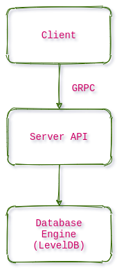

# RhinoDB
## Simple Key Value Store

The KV store will support Get, Insert operations. It is using LevelDB as storage engine and GRPC as the network interface.

## Design

  

## Features

* **High Performance**
* **High Scalability**
* **High Reliability**

## Checklist

| Crate     | Description |  Status |
|-----------|-------------|-------------|
| storage_engine | Implement RocksDB | WIP |
| transactions | Implement MultiVersion Concurrency Control | WIP |
| distributed | Add RaftGroups | TODO |
| client | Add a basic Client | TODO |
| indexing | Support GSI | TODO |
