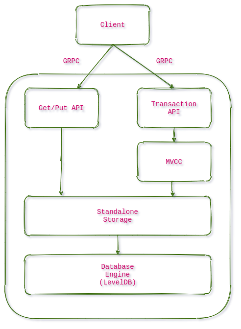

# RhinoDB
## Simple Key Value Store

KV store will support Get, Insert and Delete operations. It is using LevelDB as storage engine and GRPC as the network interface.

## Design

  

[Edit](https://viewer.diagrams.net/?highlight=0000ff&edit=_blank&layers=1&nav=1&title=simpleKV.drawio#R7Vptc9o4EP41zPQ%2BkJHf8UcwSXs3bYcencvlvim2YtQIiwoR4H79SVh%2BlQMmmCRzJV9ireTVSs%2FusyuLnhXMNx8ZXMy%2B0AiRngmiTc8a90zTcBwg%2FknJNpUMDCWIGY7UoEIwxf8iJcyGrXCElpWBnFLC8aIqDGmSoJBXZJAxuq4Oe6CkOusCxkgTTENIdOktjvhMSQ3XLzo%2BIRzP1NQD00s77mH4GDO6StR8PdN62P2l3XOY6VILXc5gRNelSa3rnhUwSnn6NN8EiMi9zbYtfe%2Fmmd7cboYS3uaFcPjHfHPL0cAfOo%2Fffn63gAv6hudbqaInSFZqS8aQw3u4RD3TJUL16J5J8%2FlWbZn7cyVtHj3QhPeXO0CHYoBhLzZFp3iK5f%2FrJMZJJ5o%2BfEZPiIxHv6ntzLWYOxCQXKYhxq1nmKPpAoaydy2cVshmfE5Udw4DkBNjQgJKKBPthAo7Rf8j4uFMDZaG3cA5JtK5A7piGMkVfEVCwQgSHCdCHgoAhNgaPSHGsfCsoeqY4yiSNu7UKM83bNXOphVuEwQAuK6cmzP6iEo9luW6AOw2oQ62wl%2FOiTZ1rxLRiugccbYVQ1Sv5SlHzAIVqPa6cHtroGSzsscrGVSRFueqC28TD8rhjnM%2BXwMTRSI8VZMyPqMxTSC5LqSjAm5Qx6t44TOlCyX8gTjfqu2HK06r%2FvBuIBZTsO3fclVXhu9kgjsh6IMrYJiZZLxRK09b23JrghgW2EhTx3vdZikWGqL92DiKjSGLkXo76t%2F6jjs3B5NPASD%2FgCgkd31D6ZTI7XVEhgjk%2BKlKvE1epV6dUCzMzh3Ytp2KA4t9q6pILVVv1XwzN%2BMkd3U0rvwotsa8maykncPJ7xdu6oSbbFfnJsN5ZW7y9oDZBfOgDeZpvDuqdVfqKcJcNrIof%2F%2Bgt2EWV2eWAxHXHbec6hWuRgEBwUgxziXyj41826uSuum%2FeeTnhVGZ5v%2BcBBrCYom8CmP7zWdI1LvwfqdKbuVCZq3dUpxRzxlLXYIwlgqeQ6C3hbILwOwqVVu%2BrQHWhJfZAV6N5YepgfXrhqIGYwPYzydhq5aELT0U88RchtYB58JWP5t%2BZzBZwpBjmpQPlekR8ZcuwE7C3gVvWIA1Qu9cqq9WZ8XKSbE4FjYfEhuLqS7LuOejuPPjoOPWEpFdc8V0CdpxUD9XDrwryzF92zA81%2FZAtSCxvbOdMhs3S68v%2F1e1x2ksZb2z2sPXwPryV6CDdclBL8lBjvfWOSi7o7h8nnxZvnxZutlXCR7MNf5Zco3tVJNCfut1dK6pKXJfObtk32pLjDXlMIkgodVbmrSgnnLK5P3ZhdBeQmj1r5ruQCe0s924NMNvXQjtFEIr1d1e9Y4GXAEzFxx%2FRdMJR%2FotOdI4z%2F2MW3f3%2Bv1MW5LUFPntSHLIGNyWhqm6tr3BDjjOLu%2FQeHPfePGQWtwtw9uXEO8oxF%2FhaL03Sbe5HznP2doHzZFxfCgPaoVTPbV1FMr1jwGevz80D4w%2FNjRFs%2FghTzq8%2BLWUdf0f)

## Features

* **High Performance**
* **High Scalability**
* **High Reliability**

## Checklist

| Crate     | Description |  Status |
|-----------|-------------|-------------|
| storage_engine | Implement RocksDB | TODO |
| transactions | Implement MultiVersion Concurrency Control | WIP |
| distributed | Add RaftGroups | TODO |
| client | Add a basic cli client | TODO |
| indexing | Support GSI | TODO |
